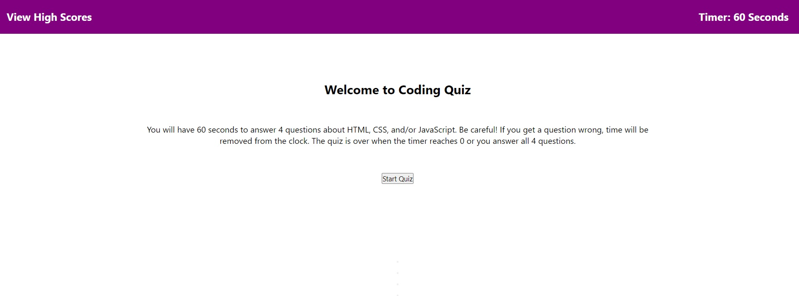

# Code-Quiz-2

## Description

### Project Motivation & Purpose

My motivation for doing this project was to learn how to use Web APIs to create elements and styling in an HTML file. This project is also important to learn how to utilize Local Storage. This coding quiz also allows me to check my own understanding of coding concepts through an interactive quiz.

This quiz can help entry level coders study while also adding a competitive element through the high score board.

### What I Learned Doing This Project

Through this project I have learned how to use DOM as well as how to utilize event listeners and functions. While I have gotten the quiz to work successfully, it is missing the a part of the acceptance criteria in regards to the parts that need to utilize concepts connected to Local Storage. I will need to seek out additional tutoring and provide an updated project once I have mastered the subject.

## Usage

This webpage can be used to take a quiz when it is completed to test your basic coding knowledge.

Deployed Website: https://jeglasper.github.io/code-quiz-2/

Git Hub Repository: https://github.com/jeglasper/code-quiz-2

## Credits

"Document Object Model". MDN Web Docs. https://developer.mozilla.org/en-US/docs/Web/API/Document_Object_Model

"JavaScript String match()". W3 Schools. https://www.w3schools.com/jsref/jsref_match.asp

## License

See repository for applicable license.